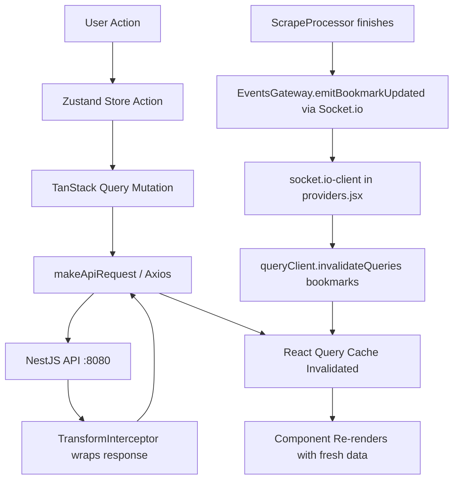
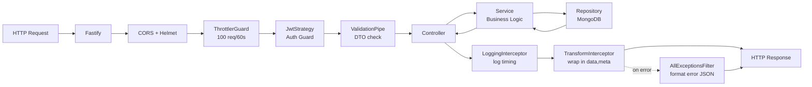
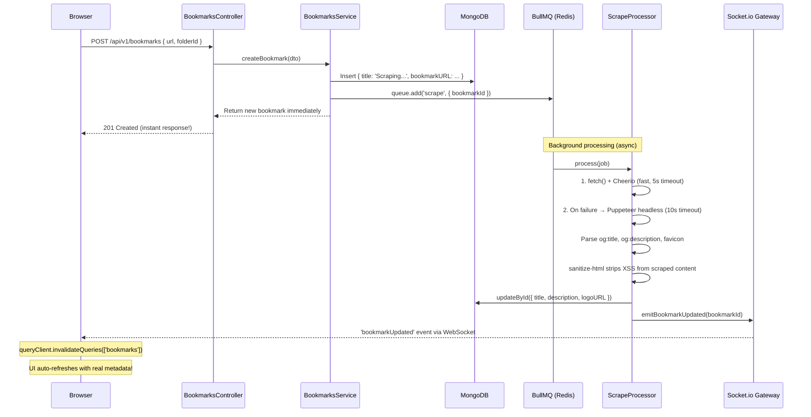
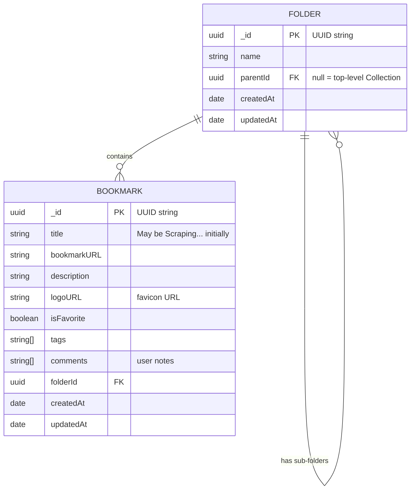

# 📚 Bookmarker

> A self-hosted, full-stack personal bookmark manager. Organize your links into Collections and Folders, auto-fetch metadata with a background scraper, and find anything instantly with a ⌘K command palette.

---

## 📋 Table of Contents

- [What is Bookmarker?](#-what-is-bookmarker)
- [Feature Overview](#-feature-overview)
- [Tech Stack at a Glance](#-tech-stack-at-a-glance)
- [Prerequisites](#-prerequisites)
- [Local Development Setup](#-local-development-setup)
- [Project Structure](#-project-structure)
- [Frontend Deep Dive](#-frontend-deep-dive)
  - [State Management](#state-management-zustand--redux-devtools)
  - [Data Fetching](#data-fetching-tanstack-query)
  - [Component Architecture](#component-architecture)
  - [Data Flow Diagram](#data-flow-diagram)
  - [Key Libraries](#frontend-key-libraries)
  - [Debugging Guide](#frontend-debugging-guide)
- [Backend Deep Dive](#-backend-deep-dive)
  - [Authentication](#authentication-google-oauth--jwt)
  - [Request Lifecycle](#request-lifecycle)
  - [Bookmark Creation & Auto-scraping](#bookmark-creation--auto-scraping)
  - [Module Breakdown](#module-breakdown)
  - [API Endpoints Reference](#api-endpoints-reference)
  - [Key Libraries](#backend-key-libraries)
  - [Debugging Guide](#backend-debugging-guide)
- [Database Design](#-database-design)
- [Configuration & Environment Variables](#-configuration--environment-variables)
- [Deployment (Free Tier)](#-deployment-free-tier)
- [CI/CD Pipeline](#️-cicd-pipeline)
- [Contributing](#-contributing)

---

## 🤔 What is Bookmarker?

Bookmarker is a self-hosted web app where you can save, organize, and search all your bookmarks in one clean interface — like a personal Pocket or Raindrop.io that you own and run yourself.

**The core idea:**

1. You paste a URL and hit save.
2. The app **immediately** saves the bookmark and returns it to you (fast!).
3. In the **background**, a queue worker fires up a browser, scrapes the page title, description, and favicon, and saves them to the database.
4. The UI **automatically updates** in real-time via a WebSocket when the scraping is done — no manual refresh needed.

---

## ✨ Feature Overview

| Feature                      | Description                                                                                                                                           |
| :--------------------------- | :---------------------------------------------------------------------------------------------------------------------------------------------------- |
| 🗂️ **Collections & Folders** | Top-level **Collections** (e.g. "Work") contain nested **Folders** (e.g. "Research"). Bookmarks live inside folders.                                  |
| 🤖 **Auto-scraping**         | Paste any URL. The backend automatically fetches the title, description, and favicon using Cheerio (fast) or Puppeteer (fallback for JS-heavy sites). |
| ⚡ **Real-time Updates**     | WebSocket (Socket.io) pushes scraped data to your browser automatically.                                                                              |
| 🔍 **⌘K Command Palette**    | Press `Cmd+K` to open a global fuzzy search across all bookmarks and folders.                                                                         |
| 🔎 **In-folder Search**      | Filter bookmarks in the current view by title, description, notes, or tags.                                                                           |
| 🏷️ **Tags**                  | Add comma-separated tags to bookmarks. Use the auto-suggest dropdown to reuse existing tags.                                                          |
| ⭐ **Favorites**             | Star bookmarks for quick access via the Favorites folder.                                                                                             |
| 📋 **Bulk Actions**          | Select multiple bookmarks, then bulk-move or bulk-delete them.                                                                                        |
| 🖱️ **Drag & Drop**           | Drag a bookmark from the list onto a folder in the sidebar to move it instantly.                                                                      |
| 🌙 **Dark Mode**             | Automatic detection of system preference with a manual toggle (powered by `next-themes`).                                                             |
| 📥 **Import / Export**       | Import bookmarks from a Netscape HTML file (standard browser export format).                                                                          |
| ⚙️ **Settings**              | Manage your account, import/export data, and danger zone (delete all).                                                                                |
| 🔒 **Google OAuth Login**    | Sign in securely with your Google account. Always prompts for account selection.                                                                      |
| 🛡️ **Secure & Fast**         | Optimized with MongoDB compound indexes, isolated WebSocket rooms to prevent data leakage, and ReDoS protection on search.                            |

---

## 🛠️ Tech Stack at a Glance

```
┌──────────────────────────────────────┐
│  Browser (React 19 + Vite + TailwindCSS 4)   │
│  State: Zustand  |  Data: TanStack Query     │
└───────────────────┬──────────────────┘
                    │ HTTP (Axios) + WebSocket (Socket.io)
┌───────────────────▼──────────────────┐
│  NestJS 11 on Fastify (Port 8080)    │
│  Auth: Google OAuth + JWT cookies    │
│  Scraping: BullMQ → Cheerio/Puppeteer│
└───────────┬──────────────┬───────────┘
            │              │
    ┌───────▼───────┐  ┌───▼────┐
    │  MongoDB      │  │  Redis │
    │  (Data Store) │  │  (BullMQ│
    └───────────────┘  └────────┘
```

---

## ✅ Prerequisites

Before you begin, make sure you have the following installed on your machine:

| Tool                        | Version | Why                                                  |
| :-------------------------- | :------ | :--------------------------------------------------- |
| **Node.js**                 | v20+    | Required for both frontend and backend               |
| **npm**                     | v10+    | Package manager (comes with Node)                    |
| **Docker & Docker Compose** | Latest  | Runs MongoDB and Redis locally with a single command |
| **A Google Cloud Project**  | —       | To create OAuth 2.0 credentials for login            |

### Setting up Google OAuth Credentials

1. Go to the [Google Cloud Console](https://console.cloud.google.com/).
2. Create a new project (or select an existing one).
3. Navigate to **APIs & Services → Credentials**.
4. Click **Create Credentials → OAuth 2.0 Client IDs**.
5. Select **Web application** as the application type.
6. Add an **Authorized Redirect URI**: `http://localhost:8080/auth/google/callback`
7. Copy the **Client ID** and **Client Secret** — you'll need these in the `.env` file.

---

## 🚀 Local Development Setup

Follow these steps in order. The whole setup should take about 10 minutes.

### Step 1: Clone the Repo

```bash
git clone https://github.com/your-username/bookmarker.git
cd bookmarker
```

### Step 2: Start MongoDB & Redis via Docker

```bash
docker-compose up -d
```

This starts:

- **MongoDB** on `localhost:27017`
- **Redis** on `localhost:6379`

You can verify they're running with `docker ps`.

### Step 3: Set up the Backend

```bash
cd backend
cp .env.example .env
```

Open `.env` and fill in your values:

```env
MONGODB_URI=mongodb://localhost:27017/bookmarker
REDIS_HOST=localhost
REDIS_PORT=6379
GOOGLE_CLIENT_ID=your-google-client-id-here
GOOGLE_CLIENT_SECRET=your-google-client-secret-here
GOOGLE_CALLBACK_URL=http://localhost:8080/auth/google/callback
JWT_SECRET=a-long-random-secret-string-change-this
FRONTEND_URL=http://localhost:5173
NODE_ENV=development
PORT=8080
```

Then install dependencies and start the dev server:

```bash
npm install
npm run dev
```

The backend starts at `http://localhost:8080`.

> **Tip:** Swagger API docs are available at `http://localhost:8080/api/docs` — a great way to explore and test all API endpoints without writing any code.

### Step 4: Set up the Frontend

Open a **new terminal tab** and run:

```bash
cd frontend
npm install
npm run dev
```

The frontend starts at `http://localhost:5173`.

### You're ready! 🎉

Open `http://localhost:5173` in your browser, click **Get Started**, and sign in with Google.

---

## 📁 Project Structure

```
bookmarker/
├── backend/                    # NestJS API server
│   ├── src/
│   │   ├── auth/               # Google OAuth + JWT strategy
│   │   ├── bookmarks/          # Bookmark CRUD + BullMQ scraper
│   │   ├── folders/            # Folder CRUD + hierarchy logic
│   │   ├── settings/           # Import/export/delete-all data
│   │   ├── events/             # Socket.io real-time gateway
│   │   └── common/             # Shared decorators, filters, interceptors
│   ├── .env.example            # Copy this to .env and fill in your values
│   └── package.json
├── frontend/                   # React + Vite SPA
│   ├── src/
│   │   ├── App.jsx             # Root component, DndContext, auth gate
│   │   ├── main.jsx            # App entry point + ErrorBoundary wrapper
│   │   ├── store/
│   │   │   └── useAppStore.js  # 🧠 Central Zustand state (see below)
│   │   ├── hooks/              # Data-fetching hooks (useBookmarks, useFolders...)
│   │   ├── components/
│   │   │   ├── bookmarks/      # BookmarkList, BookmarkDetail, BookmarkPreview
│   │   │   ├── sidebar/        # FolderSidebar + folder tree
│   │   │   ├── modalForm/      # Add/Edit bookmark form
│   │   │   ├── settings/       # Settings modal
│   │   │   ├── CommandPalette.jsx  # ⌘K global search
│   │   │   └── ErrorBoundary.jsx   # Global crash handler
│   │   ├── lib/
│   │   │   ├── utils.js        # makeApiRequest() + cn() helper
│   │   │   └── metadata.js     # BASE_URL constant
│   │   └── providers.jsx       # React Query, ThemeProvider, Socket.io
│   ├── .env.example
│   └── vite.config.ts
├── docker-compose.yml          # MongoDB + Redis
├── .prettierrc                 # Code formatting config
├── commitlint.config.js        # Conventional commits enforcement
└── README.md
```

---

## 🎨 Frontend Deep Dive

### State Management (Zustand + Redux DevTools)

All UI state lives in a **single central store** at `src/store/useAppStore.js`. This was a deliberate architectural choice to avoid prop-drilling and make the app easy to debug.

The store is wired with **Zustand DevTools middleware**, meaning you can install the [Redux DevTools browser extension](https://chromewebstore.google.com/detail/redux-devtools/lmhkpmbekcpmknklioeibfkpmmfibljd) and get a full time-travel debugger — inspect every state change in real-time.

**What lives in the store:**

| State Slice           | What it controls                                                     |
| :-------------------- | :------------------------------------------------------------------- |
| `theme`               | `'light'` or `'dark'`. Persisted in `localStorage`.                  |
| `isSidebarCompact`    | Whether the sidebar is collapsed.                                    |
| `isSettingsModalOpen` | Whether the Settings modal is open.                                  |
| `selectedBookmark`    | The currently focused bookmark for the detail pane.                  |
| `bookmarkFormModal`   | `{ isOpen, type ('add'                                               | 'edit'), data }` for the add/edit form. |
| `selectedBookmarks`   | A `Set<string>` of IDs for bulk operations.                          |
| `searchQuery`         | The current search string in the bookmark list.                      |
| `searchFields`        | Which fields to search in (`title`, `description`, `notes`, `tags`). |

**How to use the store in a component:**

```jsx
import { useAppStore } from "@/store/useAppStore";

function MyComponent() {
  // Only subscribe to the slices you need (prevents unnecessary re-renders)
  const { selectedBookmark, openBookmarkModal } = useAppStore();

  return (
    <button onClick={() => openBookmarkModal("edit", selectedBookmark)}>
      Edit
    </button>
  );
}
```

---

### Data Fetching (TanStack Query)

**Server state** (data that comes from the API) is managed by [TanStack Query](https://tanstack.com/query/latest). This handles caching, background refetching, loading states, and optimistic updates automatically.

All custom query hooks live in `src/hooks/`:

| Hook File         | Exports                                                                                                                                    |
| :---------------- | :----------------------------------------------------------------------------------------------------------------------------------------- |
| `useBookmarks.js` | `useBookmarks`, `useDeleteBookmark`, `useCreateBookmark`, `useUpdateBookmark`, `useBulkDeleteBookmarks`, `useBulkMoveBookmarks`, `useTags` |
| `useFolders.js`   | `useFolders`, `useCreateFolder`, `useUpdateFolder`, `useDeleteFolder`                                                                      |
| `useAuth.js`      | `useAuth` (fetches `/auth/status` to check if user is logged in)                                                                           |
| `useSettings.js`  | `useImportData`, `useDeleteAllData`                                                                                                        |

**Example — creating a bookmark:**

```js
import { useCreateBookmark } from "@/hooks/useBookmarks";

const createBookmark = useCreateBookmark();

createBookmark.mutate(
  {
    bookmarkURL: "https://github.com",
    folderId: "some-folder-uuid",
    tags: ["code", "tools"],
  },
  {
    onSuccess: () => console.log("Saved!"),
    onError: (err) => console.error("Failed:", err),
  }
);
```

---

### Component Architecture

The app avoids prop-drilling by having components **connect directly to the Zustand store** rather than passing state down through many layers.

```
App.jsx
├── FolderSidebar          → reads useFolders(), reads/writes isSidebarCompact
├── BookmarksView          → reads bookmarkFormModal from store
│   ├── BookmarkList       → reads selectedBookmark, searchQuery, selectedBookmarks
│   └── BookmarkDetail     → reads selectedBookmark, calls openBookmarkModal
├── CommandPalette         → triggered by ⌘K keydown
└── SettingsModal          → toggled by isSettingsModalOpen
```

**ErrorBoundary** wraps the entire React tree in `main.jsx`. If any component crashes during render, it shows a friendly fallback UI with the error details and a "Reload Application" button instead of a blank white screen.

---

### Data Flow Diagram



---

### Frontend Key Libraries

| Library          | Version | Purpose                                              |
| :--------------- | :------ | :--------------------------------------------------- |
| React            | 19      | UI framework, concurrent rendering                   |
| Vite + SWC       | 8       | Dev server & bundler (SWC is ~20x faster than Babel) |
| TailwindCSS      | 4       | Utility-first CSS framework                          |
| Zustand          | 5       | Lightweight global state (+ Redux DevTools support)  |
| TanStack Query   | 5       | Server state: caching, background refetch, mutations |
| TanStack Virtual | 3       | Virtualizes long bookmark lists for performance      |
| React Router DOM | 7       | URL routing; active folder is `?folder=<uuid>`       |
| React Hook Form  | 7       | Form state management (no re-render on keypress)     |
| Zod              | 3       | Schema validation for form inputs                    |
| @dnd-kit/core    | 6       | Accessible drag-and-drop                             |
| Framer Motion    | 12      | Smooth list animations                               |
| socket.io-client | 4       | WebSocket for real-time updates                      |
| Axios            | 1       | HTTP client with request/response interceptors       |
| sonner           | 2       | Toast notifications                                  |
| cmdk             | 1       | Command palette (⌘K)                                 |
| lucide-react     | latest  | Icon library                                         |
| next-themes      | latest  | System-aware dark/light mode management              |
| dayjs            | latest  | Lightweight date formatting                          |

---

### Frontend Debugging Guide

**Check the Zustand Store:**
Install the [Redux DevTools extension](https://chromewebstore.google.com/detail/redux-devtools/lmhkpmbekcpmknklioeibfkpmmfibljd) in Chrome. Open DevTools → Redux tab. You'll see every state action logged (e.g., `setSelectedBookmark`, `toggleSearchField`) and can time-travel to any past state.

**Check API Calls:**
Open DevTools → **Network tab** → filter by `XHR`. All API requests go through `makeApiRequest()` in `src/lib/utils.js`. The backend wraps all responses in `{ data, meta }` — `makeApiRequest` automatically unwraps the `data` field for you.

**Check React Query Cache:**
In development, you can add `ReactQueryDevtools` to `providers.jsx` to see all cached queries, their status, and their data.

**Common errors:**

| Error                            | Likely Cause                                                     |
| :------------------------------- | :--------------------------------------------------------------- |
| Blank page on load               | Backend is down or not running. Check `localhost:8080/api/docs`. |
| "cn is not defined"              | Import `cn` from `@/lib/utils`.                                  |
| Toast: "Request failed with 401" | JWT cookie expired or you are not logged in.                     |
| Search not updating              | Debounce is 300ms — wait a moment after typing.                  |

---

## 🔧 Backend Deep Dive

### Authentication (Google OAuth + JWT)

The auth flow works as follows:

1. User clicks **Get Started** on the landing page.
2. Frontend redirects to `GET /auth/google`.
3. The backend's `GoogleAuthGuard` redirects the browser to Google's consent screen. The guard passes `prompt: 'select_account'` so users always see an account chooser (even if they were previously logged in).
4. Google redirects back to `GET /auth/google/callback` with a code.
5. The backend exchanges the code for a Google profile (`email`, `name`, `picture`).
6. A **JWT** containing `{ email, name, picture }` is signed with `JWT_SECRET` and set as an **httpOnly cookie** named `auth_token` (24-hour expiry).
7. The browser is redirected to the frontend (`FRONTEND_URL`).
8. On subsequent requests, the `JwtStrategy` extracts the cookie and validates it — no session store needed.

**To log out:** `GET /auth/logout` clears the cookie and redirects to the frontend.

> **Security note:** The JWT cookie is `httpOnly` (JavaScript cannot read it) and `sameSite: lax`, protecting against XSS and CSRF attacks.

---

### Request Lifecycle

Every HTTP request flows through this NestJS pipeline in order:



---

### Bookmark Creation & Auto-scraping

This is the most complex part of the backend. Here's exactly what happens when you save a bookmark:



**Key design decisions:**

- The API returns the bookmark **immediately** after saving the placeholder. The user sees their bookmark right away — no waiting for scraping.
- The scraper first tries the fast **Cheerio** path (simple HTTP fetch + HTML parse). If that fails (JavaScript-rendered pages), it falls back to **Puppeteer** (headless Chrome).
- `sanitize-html` strips any malicious HTML from scraped content before saving.
- BullMQ retries failed jobs automatically with exponential backoff.

---

### Module Breakdown

**Backend folder: `backend/src/`**

| Module       | Files                                                                                                     | Responsibility                                               |
| :----------- | :-------------------------------------------------------------------------------------------------------- | :----------------------------------------------------------- |
| `auth/`      | `auth.controller.ts`, `google.strategy.ts`, `jwt.strategy.ts`, `google-auth.guard.ts`                     | Google OAuth login/logout, JWT cookie, account-select prompt |
| `bookmarks/` | `bookmarks.controller.ts`, `bookmarks.service.ts`, `bookmarks.repository.ts`, `scrape.processor.ts`       | Full bookmark CRUD + async scraping queue                    |
| `folders/`   | `folders.controller.ts`, `folders.service.ts`, `folders.repository.ts`                                    | Folder CRUD, Inbox auto-creation, hierarchy resolution       |
| `settings/`  | `settings.controller.ts`, `settings.service.ts`                                                           | HTML import, data export, delete-all                         |
| `events/`    | `events.gateway.ts`                                                                                       | Socket.io server — emits `bookmarkUpdated` events            |
| `common/`    | `base.repository.ts`, `http-exception.filter.ts`, `transform.interceptor.ts`, `current-user.decorator.ts` | Shared base classes and cross-cutting concerns               |

**`common/` deep dive:**

- **`base.repository.ts`** — A generic class with `findById`, `findAll`, `create`, `updateById`, `deleteById`, `deleteMany`. Both `BookmarksRepository` and `FoldersRepository` extend this, so you don't write the same MongoDB boilerplate twice.
- **`http-exception.filter.ts`** — Catches _every_ exception (not just `HttpException`) and formats it into a clean `{ statusCode, message, timestamp }` JSON. It also reads the `X-Request-Meta` request header from the frontend (which includes a `requestId`) so backend logs can be correlated with frontend requests.
- **`transform.interceptor.ts`** — Wraps every successful response in `{ data: ..., meta: { timestamp } }`. This gives the frontend a consistent API contract.
- **`current-user.decorator.ts`** — A `@CurrentUser()` parameter decorator. Instead of `(req as any).user.email`, controllers use `@CurrentUser() user` for type-safe access to the authenticated user.

---

### API Endpoints Reference

**Auth** (no `/api/v1` prefix):

| Method | Path                    | Description                                        |
| :----- | :---------------------- | :------------------------------------------------- |
| `GET`  | `/auth/google`          | Redirects to Google sign-in (with account chooser) |
| `GET`  | `/auth/google/callback` | Google OAuth callback — issues JWT cookie          |
| `GET`  | `/auth/status`          | Returns `{ email, name, picture }` from JWT        |
| `GET`  | `/auth/logout`          | Clears cookie, redirects to frontend               |

**Bookmarks** (`/api/v1/bookmarks`):

| Method   | Path           | Query Params              | Description                              |
| :------- | :------------- | :------------------------ | :--------------------------------------- |
| `GET`    | `/`            | `folderId`, `q`, `fields` | List bookmarks with optional search      |
| `POST`   | `/`            | —                         | Create a bookmark (triggers auto-scrape) |
| `GET`    | `/tags`        | —                         | Get all unique tags (cached 5 min)       |
| `POST`   | `/bulk-delete` | —                         | Delete multiple bookmarks by ID          |
| `POST`   | `/bulk-move`   | —                         | Move multiple bookmarks to a folder      |
| `GET`    | `/:id`         | —                         | Get a single bookmark                    |
| `PUT`    | `/:id`         | —                         | Update a bookmark                        |
| `DELETE` | `/:id`         | —                         | Delete a bookmark                        |

**Folders** (`/api/v1/folders`):

| Method   | Path            | Query Params | Description                                   |
| :------- | :-------------- | :----------- | :-------------------------------------------- |
| `GET`    | `/`             | —            | Get all folders (Inbox guaranteed to exist)   |
| `POST`   | `/`             | —            | Create a folder/collection                    |
| `GET`    | `/:id`          | —            | Get a folder                                  |
| `GET`    | `/:id/children` | —            | Get sub-folders                               |
| `PUT`    | `/:id`          | —            | Rename a folder                               |
| `DELETE` | `/:id`          | `action`     | Delete: `delete_bookmarks` or `move_to_inbox` |

**Search filter logic** (`folderId` param):

- `folderId=root` → all bookmarks (no filter)
- `folderId=favorites` → only `isFavorite: true`
- `folderId=<uuid>` → single folder
- `folderId=<uuid1>,<uuid2>` → all sub-folders of a collection (comma-separated)

---

### Backend Key Libraries

| Library                   | Purpose                                               |
| :------------------------ | :---------------------------------------------------- |
| NestJS 11                 | Modular, opinionated framework with DI and decorators |
| Fastify                   | HTTP server, ~2x faster than Express                  |
| `@fastify/helmet`         | Secure HTTP headers (XSS, clickjacking protection)    |
| `@fastify/cookie`         | Cookie parsing for JWT auth                           |
| Mongoose 9                | MongoDB ODM with schema validation                    |
| BullMQ                    | Redis-backed job queue for async scraping             |
| Puppeteer 25              | Headless Chrome for scraping JS-rendered pages        |
| Cheerio                   | Fast HTML parser for static pages                     |
| `sanitize-html`           | Strips XSS from scraped content                       |
| `nestjs-pino`             | Structured JSON logging                               |
| `@nestjs/throttler`       | Rate limiting: 100 req/60s per IP                     |
| `@nestjs/swagger`         | Auto-generates OpenAPI docs at `/api/docs`            |
| `passport-google-oauth20` | Google OAuth 2.0 strategy                             |
| `passport-jwt`            | JWT cookie validation strategy                        |
| `uuid v4`                 | Portable string IDs instead of MongoDB ObjectIds      |

---

### Backend Debugging Guide

**Pino Logs:** In `development`, `pino-pretty` formats logs with colors and readable timestamps. In `production`, logs are structured JSON (pipe to a log aggregator like Datadog or CloudWatch).

**Swagger UI:** Open `http://localhost:8080/api/docs` to visually test all API endpoints. Every endpoint is documented with expected request/response schemas.

**Connecting to MongoDB directly:**

```bash
# Find the container name
docker ps

# Connect to MongoDB shell
docker exec -it <mongo-container-name> mongosh "mongodb://localhost:27017/bookmarker"

# Useful queries
> db.bookmarks.find().pretty()
> db.bookmarks.find({ folderId: "some-uuid" }).pretty()
> db.folders.find({ parentId: null }).pretty()   // all collections
```

**Common errors:**

| Error                            | Likely Cause                                                               |
| :------------------------------- | :------------------------------------------------------------------------- |
| `ECONNREFUSED` on startup        | MongoDB or Redis isn't running. Run `docker-compose up -d`.                |
| `401 Unauthorized`               | JWT cookie missing or expired. Re-login.                                   |
| `400 Bad Request` on POST        | DTO validation failed. Check the response body for which field is invalid. |
| Bookmarks stuck at "Scraping..." | Redis not running (BullMQ queue isn't being processed). Check `docker ps`. |
| Google OAuth redirect mismatch   | The callback URL in `.env` doesn't match what's in Google Cloud Console.   |

---

## 🗄️ Database Design

### Schema



### Key Design Decisions

**UUIDs instead of ObjectIds:** We use `uuid v4` strings as `_id` instead of MongoDB's native `ObjectId`. This keeps IDs portable, readable in URLs, and consistent if you ever need to migrate databases.

**Inbox folder auto-creation:** The first time a user fetches their folders, the system uses MongoDB's `findOneAndUpdate` with `upsert: true` (an atomic operation) to guarantee the "Inbox" folder always exists. This avoids race conditions.

**Folder terminology:**

- **Collection** = a top-level folder (`parentId: null`). Examples: "Work", "Personal".
- **Folder** = a sub-folder inside a collection (`parentId: <collectionId>`). Examples: "Research", "Articles".

**Caching strategy:**

- ✅ **Cached (5 min):** `GET /api/v1/bookmarks/tags` — tags change infrequently, safe to cache.
- ❌ **Never cached:** Bookmarks, Folders — stale data caused incorrect deletes in earlier versions, so caching was removed.

---

## 🔐 Configuration & Environment Variables

All secrets are managed via environment variables. **Never commit `.env` to version control.**

Copy the template: `cd backend && cp .env.example .env`

| Variable               | Required | Default                 | Description                                                  |
| :--------------------- | :------- | :---------------------- | :----------------------------------------------------------- |
| `MONGODB_URI`          | ✅       | —                       | Full MongoDB connection string                               |
| `REDIS_HOST`           | ✅       | —                       | Redis hostname for BullMQ                                    |
| `REDIS_PORT`           | ✅       | `6379`                  | Redis port                                                   |
| `GOOGLE_CLIENT_ID`     | ✅       | —                       | From Google Cloud Console                                    |
| `GOOGLE_CLIENT_SECRET` | ✅       | —                       | From Google Cloud Console                                    |
| `GOOGLE_CALLBACK_URL`  | ✅       | —                       | Must match exactly in Google Cloud Console                   |
| `JWT_SECRET`           | ✅       | —                       | Long random string. Generate with: `openssl rand -base64 32` |
| `FRONTEND_URL`         | ✅       | `http://localhost:5173` | For CORS and post-login redirect                             |
| `NODE_ENV`             | —        | `development`           | Enables secure cookies and structured logs in `production`   |
| `PORT`                 | —        | `8080`                  | Backend API port                                             |

**Frontend variables** (in `frontend/.env`):

| Variable            | Description                                           |
| :------------------ | :---------------------------------------------------- |
| `VITE_API_BASE_URL` | Backend API URL, e.g., `http://localhost:8080/api/v1` |

---

## ☁️ Deployment (Free Tier) & CI/CD

You can run Bookmarker in the cloud for **$0/month** using Vercel (Frontend), Render (Backend), MongoDB Atlas (Database), and Upstash (Redis).

We have provided a comprehensive, step-by-step guide on how to deploy this stack for free.
Please refer to the **[DEPLOYMENT_GUIDE.md](./DEPLOYMENT_GUIDE.md)** located in the root of the repository for full instructions.

### ⚙️ CI/CD Pipeline

This repository comes pre-configured with a professional GitHub Actions CI/CD pipeline!

Every push to `main` and every Pull Request automatically:

1. Spins up a free Ubuntu server via GitHub Actions.
2. Installs frontend and backend dependencies.
3. Builds the NestJS backend and runs backend tests.
4. Builds the React frontend to ensure there are no compilation errors.
5. If the CI check passes ✅, Vercel and Render will automatically deploy the fresh code.

The pipeline is fully configured out-of-the-box in `.github/workflows/ci.yml`.

---

## 🤝 Contributing

**Commit convention:** We enforce [Conventional Commits](https://www.conventionalcommits.org/) via Husky + commitlint. Your commit message must match: `type(scope): subject`.

Examples:

```bash
git commit -m "feat(bookmarks): add tag autocomplete"
git commit -m "fix(auth): handle expired JWT cookie gracefully"
git commit -m "chore(deps): update tailwindcss to v4.1"
```

Valid types: `feat`, `fix`, `docs`, `style`, `refactor`, `test`, `chore`.

**Code style:** Run `npm run format` in either `frontend/` or `backend/` to auto-format with Prettier before committing.

**Pre-commit hooks:** Husky runs `lint-staged` automatically on `git commit` — it formats changed files with Prettier so you never commit unformatted code.
