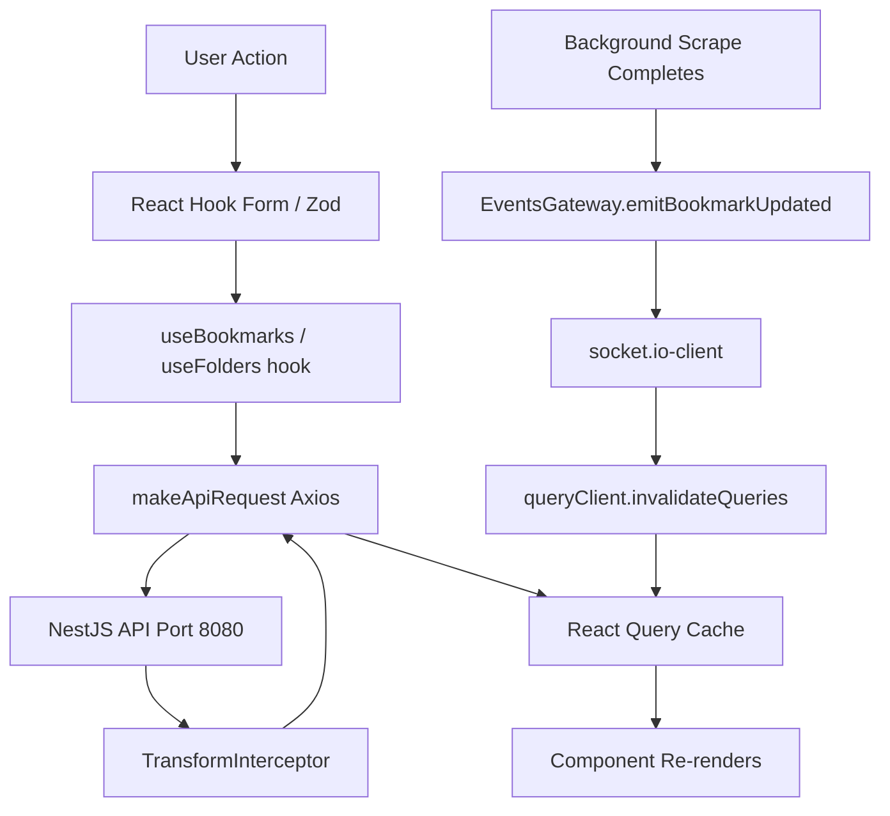
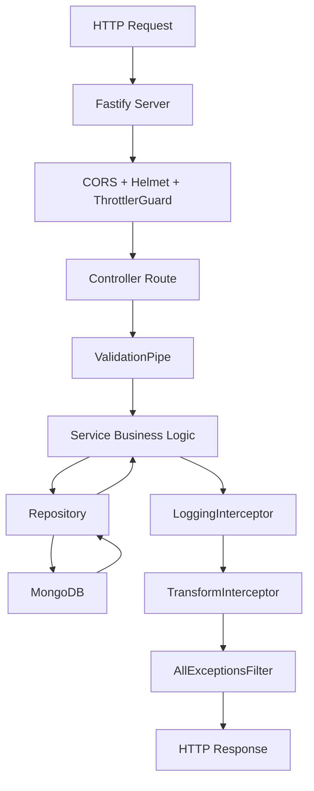
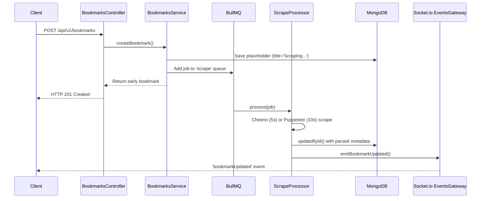
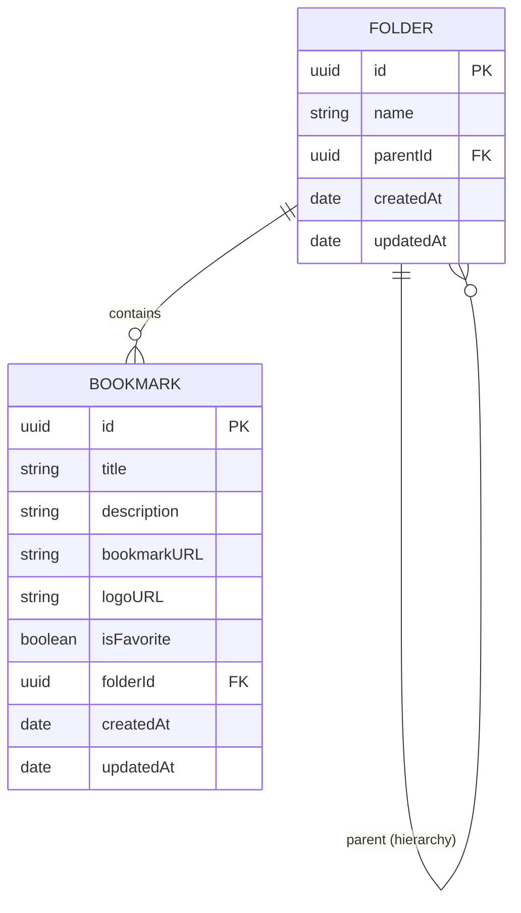

# Bookmarker

Bookmarker is a self-hosted personal bookmark manager. Users organize bookmarks into Collections (top-level groups) and Folders (sub-folders inside collections). When a bookmark is saved, the backend immediately returns it with placeholder text ('Scraping...') and asynchronously scrapes the page title, description, and favicon via a background queue. The UI updates in real-time via WebSocket when scraping completes.

## Features

- **Organized Bookmarks**: Group into top-level Collections and nested Folders.
- **Auto-scraping**: Automatically fetches title, description, and favicon via BullMQ & Puppeteer.
- **Real-time UI**: WebSocket updates push scraped metadata back to the client instantly.
- **Fast Search & Filtering**: ⌘K command palette, filtering, and tag management.
- **Drag & Drop**: Easily reorganize your bookmarks and folders.
- **Dark Mode**: Built-in dark mode based on system preferences.

## Prerequisites

- **Node.js**: v20+
- **Docker & Docker Compose**: For spinning up MongoDB and Redis locally.
- **Google Cloud Project**: For Google OAuth 2.0 credentials.

## Quick Start

1. **Clone the repository:**

   ```bash
   git clone https://github.com/your-username/bookmarker.git
   cd bookmarker
   ```

2. **Start Docker services (MongoDB & Redis):**

   ```bash
   docker-compose up -d
   ```

3. **Set up Backend:**

   ```bash
   cd backend
   cp .env.example .env
   # Edit .env and fill in your Google OAuth credentials and JWT secret
   npm install
   npm run dev
   ```

4. **Set up Frontend:**
   ```bash
   cd ../frontend
   # (Optional) default setup for local dev
   echo "VITE_API_BASE_URL=http://localhost:8080/api/v1" > .env
   npm install
   npm run dev
   ```
   _Frontend runs on `http://localhost:5173`, Backend API on `http://localhost:8080`_

## Frontend Architecture

### Data Flow



### Key Libraries

| Library                     | Purpose / Why chosen                                                              |
| --------------------------- | --------------------------------------------------------------------------------- |
| React 19                    | UI framework, concurrent rendering                                                |
| Vite 8 + SWC                | Fast dev server & build; SWC compiler is ~20x faster than Babel                   |
| TailwindCSS 4               | Utility-first CSS; co-locates styles with components                              |
| @tanstack/react-query v5    | Server-state management: auto caching, background refetch, optimistic updates     |
| @tanstack/react-virtual v3  | Virtualizes the bookmark list so only visible DOM nodes render                    |
| Zustand v5                  | Minimal client-state (sidebar collapse, theme). Replaces Redux for local UI state |
| React Router DOM v7         | URL-driven navigation; folder selection is a search param `?folder=<id>`          |
| React Hook Form v7 + Zod v3 | Performant form management + schema validation                                    |
| @dnd-kit/core v6            | Drag-and-drop: bookmarks can be dragged onto sidebar folders                      |
| Framer Motion v12           | Micro-animations on list items (mount/exit)                                       |
| socket.io-client v4         | Real-time WebSocket; listens for `bookmarkUpdated` events                         |
| Axios v1                    | HTTP client with global interceptor                                               |
| sonner v2                   | Toast notifications                                                               |
| cmdk v1                     | Command palette (⌘K) for quick folder/bookmark search                             |
| lucide-react                | Icon library                                                                      |
| next-themes                 | Dark/light mode with system preference sync                                       |
| dayjs                       | Lightweight date formatting                                                       |

### Debugging Guide

- **Browser DevTools**: Use the Network tab to view API calls.
- **React Query Devtools**: Can be enabled to inspect cached queries (like `['bookmarks']`).
- **Tracing Errors**: If a toast error pops up, check the axios interceptor in `lib/utils.js`. It unwraps the API response `{ data, meta }`. A server error can be traced from the toast back to the network tab, and then to the backend logs.

## Backend Architecture

### Request Lifecycle



### Bookmark Creation Flow



### Module Breakdown

| Module                | Description                                                                 |
| --------------------- | --------------------------------------------------------------------------- |
| `app.module.ts`       | Root module: imports ConfigModule, MongooseModule, BullMQ, Cache, Throttler |
| `bookmarks.module.ts` | HTTP routes, Service logic, DB Repository, and ScrapeProcessor for BullMQ   |
| `folders.module.ts`   | CRUD logic for folders and nested hierarchy resolution                      |
| `auth.module.ts`      | Handles Google OAuth callbacks, JWT issuing, and logout functionality       |
| `events.module.ts`    | Socket.io server logic (EventsGateway) for real-time updates                |

### Key Libraries

| Library                 | Purpose                                          |
| ----------------------- | ------------------------------------------------ |
| NestJS 11               | Opinionated modular framework                    |
| Fastify                 | High-performance HTTP server                     |
| Mongoose 9              | MongoDB ODM                                      |
| BullMQ                  | Redis-backed job queue for background scraping   |
| Puppeteer 25 & Cheerio  | Headless browser & fast HTML parser for scraping |
| passport-google-oauth20 | OAuth strategy                                   |
| uuid v4                 | ID generation                                    |

### Debugging Guide

- **Pino Logs**: Backend uses `nestjs-pino`. In dev, `pino-pretty` formats it nicely. Look out for controller execution times or exception traces.
- **Swagger UI**: Visit `http://localhost:8080/api/docs` to test endpoints visually.
- **HTTP Errors**:
  - `400 Bad Request`: ValidationPipe caught an invalid DTO. Check the JSON payload.
  - `404 Not Found`: ID missing in MongoDB.
  - `500 Internal Server Error`: Usually a database connection issue or unhandled promise.

## Database

### ER Diagram



### Example Scenario

User creates a Collection 'Work' (parentId=null). Inside 'Work', they create a folder 'Research'. They save a bookmark `github.com` into 'Research'.

**Folders Document:**

```json
{
  "_id": "c8933d81-6972-4bdc-8503-f641e728545a",
  "name": "Research",
  "parentId": "d3811d81-1234-4bdc-8503-f641e728545b",
  "createdAt": "2026-08-02T16:05:19.260Z",
  "updatedAt": "2026-08-02T16:05:19.260Z"
}
```

**Bookmark Document:**

```json
{
  "_id": "4bbc552a-1e5b-44fd-b906-d290b3dcf55e",
  "title": "GitHub",
  "author": "",
  "logoURL": "https://github.com/favicon.ico",
  "bookmarkURL": "https://github.com",
  "description": "Where the world builds software",
  "tags": ["dev", "code"],
  "comments": ["my go-to for open source"],
  "isFavorite": false,
  "folderId": "c8933d81-6972-4bdc-8503-f641e728545a",
  "createdAt": "2026-08-02T15:39:59.618Z",
  "updatedAt": "2026-08-02T16:00:01.218Z",
  "__v": 0
}
```

### UUID Strategy

We use `uuid v4` strings instead of MongoDB's native `ObjectId`. This makes the IDs portable, easier to generate on the client if necessary, and consistent across database migrations without relying on Mongo-specific types.

### Caching

- **Cached**: `GET /api/v1/bookmarks/tags` is cached for 5 minutes via `@nestjs/cache-manager` (in-memory) because global tags rarely change.
- **Not Cached**: All other endpoints (folders, bookmarks). We previously cached folders but it led to stale data and delete inconsistencies.

### Debugging MongoDB

Connect via Docker:

```bash
docker exec -it <mongo-container> mongosh "mongodb://localhost:27017/bookmarker"
> db.bookmarks.find({ folderId: "c8933d81..." }).pretty()
```

## Configuration / Secrets

All configuration is managed via environment variables.

### Environment Variables

| Variable               | Description                               |
| ---------------------- | ----------------------------------------- |
| `MONGODB_URI`          | Connection string to MongoDB              |
| `REDIS_HOST`           | Redis host for BullMQ                     |
| `REDIS_PORT`           | Redis port                                |
| `GOOGLE_CLIENT_ID`     | OAuth Client ID from Google Cloud         |
| `GOOGLE_CLIENT_SECRET` | OAuth Client Secret                       |
| `GOOGLE_CALLBACK_URL`  | Route for Google OAuth to return to       |
| `JWT_SECRET`           | Secure string used to sign JWT cookies    |
| `FRONTEND_URL`         | Used for CORS and redirecting after login |
| `NODE_ENV`             | `development` or `production`             |
| `PORT`                 | API server port (default 8080)            |

> ⚠️ **IMPORTANT**: NEVER commit `.env` or `.env.local` files to version control. They are listed in `.gitignore`. Use `.env.example` as a template for new developers.

## Self-hosting / Production

- **Build**: Use `npm run build` in both frontend and backend directories.
- **NODE_ENV=production**: Ensures secure cookies are set (`secure: true`, `sameSite: 'lax'`) and switches pino logging to structured JSON (disables `pino-pretty`).
- **Nginx Reverse Proxy**: It's highly recommended to serve the frontend via Nginx and proxy `/api` and `/auth` requests to the NestJS backend on port 8080.

## Contributing

- **Code Style**: Format with Prettier (`npm run format`).
- **Commits**: We use conventional commits enforced by Husky. Ensure your commit messages match the `type(scope): subject` format.
